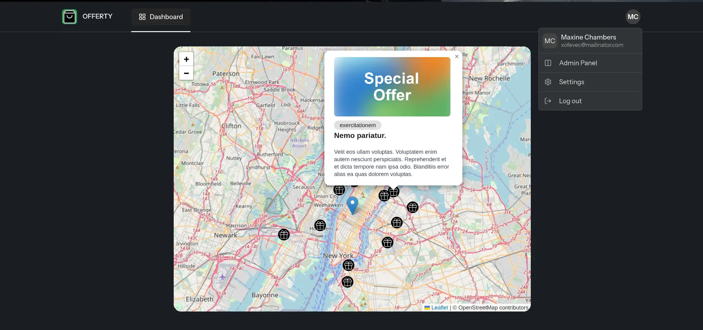
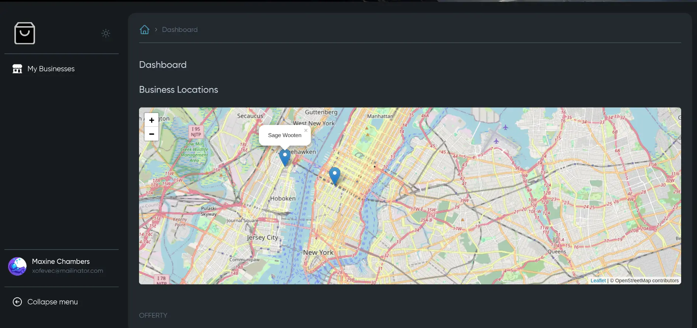
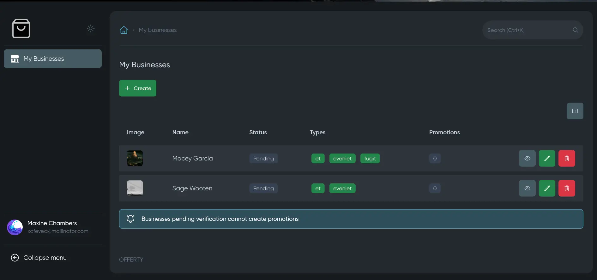

# Offerty

A **modern web application to publish offers and visualize them on an interactive map.** Built with a modular architecture and powerful Laravel ecosystem tools.

| Home | Dashboard | Panel |
|:----:|:----------:|:-----:|
|  |  |  |


---

## 📦 **Core Technologies**

| Package                     | Version |
| --------------------------- | ------- |
| Laravel                     | v11     |
| Inertia                     | v2      |
| MoonShine                   | v3      |
| moonshine-roles-permissions | v3      |
| internachi/modular          | v2      |

---

## ⚙️ **Installation Guide**

### 1. Clone the Repository

```bash
git clone https://github.com/maycolmunoz/offerty.git
cd offerty
```

### 2. Set Up the Environment

```bash
cp .env.example .env
composer install
npm install
npm run dev
```

### 3. Run the Installer

```bash
php artisan launch:install
```

The installer will automatically:

- Generate the application key
- Run database migrations
- Set up permissions and the superadmin role
- Create the initial Super Admin user
- Create the storage symbolic link
- Seed the database with test data

### 4. Copy the example images:

```bash
cp -r app-modules/core/resources/images/*  storage/app/public
```
